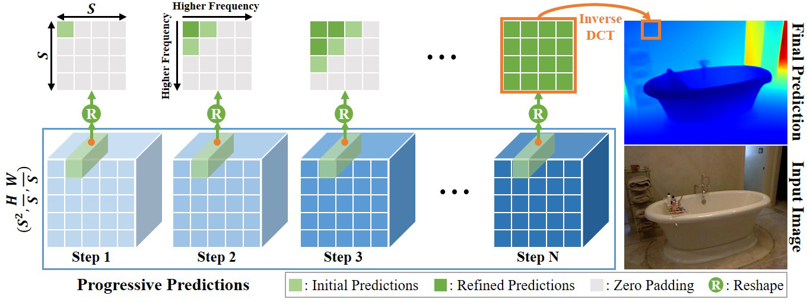

<div align="center">

<h1>DCDepth: Progressive Monocular Depth Estimation<br>in Discrete Cosine Domain</h1>

<div>
    <a href='https://w2kun.github.io' target='_blank'>Kun Wang</a><sup>1</sup>&emsp;
    <a href='https://yanzq95.github.io/' target='_blank'>Zhiqiang Yan</a><sup>1</sup>&emsp;
    <a href='https://fanjunkai1.github.io/' target='_blank'>Junkai Fan</a><sup>1</sup>&emsp;
    <a target='_blank'>Wanlu Zhu</a><sup>1</sup>&emsp;
    <a href='https://implus.github.io/' target='_blank'>Xiang Li</a><sup>2</sup>&emsp;
    <a href='https://scholar.google.com/citations?user=iGPEwQsAAAAJ&hl=zh-CN' target='_blank'>Jun Li</a><sup>1</sup>&emsp;
    <a href='https://scholar.google.com/citations?user=6CIDtZQAAAAJ&hl=zh-CN' target='_blank'>Jian Yang</a><sup>1</sup>
</div>

<div>
    <sup>1</sup>PCA Lab, Nanjing University of Science and Technology<br><sup>2</sup>Nankai University
</div>

<div>
    <h4 align="center">
        <a href="https://arxiv.org/abs/2410.14980" target='_blank'>NeurIPS 2024</a>
    </h4>
</div>
</div>

## Abstract
<div align="center">
<div style="text-align:center">

</div>

<div align="justify">
<strong>In this paper, we introduce DCDepth, a novel framework for the long-standing monocular depth estimation task. Moving beyond conventional pixel-wise depth estimation in the spatial domain, our approach estimates the frequency coefficients of depth patches after transforming them into the discrete cosine domain. This unique formulation allows for the modeling of local depth correlations within each patch. Crucially, the frequency transformation segregates the depth information into various frequency components, with low-frequency components encapsulating the core scene structure and high-frequency components detailing the finer aspects. This decomposition forms the basis of our progressive strategy, which begins with the prediction of low-frequency components to establish a global scene context, followed by successive refinement of local details through the prediction of higher-frequency components. We conduct comprehensive experiments on NYU-Depth-V2, TOFDC, and KITTI datasets, and demonstrate the state-of-the-art performance of DCDepth. </strong>

---
</div>
</div>

## Environment
Our code has been tested in the following environment:

```
python==3.10.14
pytorch==1.13.1
pytorch-lightning==1.9.5
numpy==1.26.4
scipy==1.14.0
mmcv-full==1.7.0
matplotlib==3.9.0
```

## Dataset

You can prepare the KITTI and NYU-Depth-V2 datasets according to [here](https://github.com/cleinc/bts/tree/master/pytorch), and download the TOFDC dataset from [here](https://yanzq95.github.io/projectpage/TOFDC/index.html). Then you can specify the dataset path in the corresponding configuration file to properly load the data. The train/val/test split files are provided in the `data_splits` folder.

## Training
The pretrained weights of the Swin-Transformer backbone can be downloaded from [here](https://github.com/microsoft/Swin-Transformer). To correctly load them, specify the file path of the downloaded weights in the `model/pretrain` path of the corresponding configuration file. For training on the KITTI Official dataset, download the pretrained weights from [here](https://github.com/UX-Decoder/Semantic-SAM) and configure them in the same manner.

Use the following command to start the training process:

```
python train.py CONFIG_FILE_NAME --gpus NUMBER_OF_GPUS
```

For example, to launch training on the NYU-Depth-V2 dataset with 4 GPUs, you can use `python train.py dct_nyu_pff --gpus 4`. Our training utilizes the Data Distributed Parallel (DDP) support provided by `pytorch` and `pytorch-lightning`.

## Evaluation

Use the following command to launch the evaluation process:

```
python test.py CONFIG_FILE_NAME CHECKPOINT_PATH --vis
```

For example, to evaluate the model trained on the NYU-Depth-V2 dataset, use: `python test.py dct_nyu_pff checkpoints/dcdepth_nyu.pth`. Specify the `--vis` option to save the visualization results.

## Model Zoo

We release the model checkpoints that can reproduce the results reported in our paper. The first three error metrics of TOFDC are multiplied by 10 for presentation.
<div align="center">

| Model                                                        | Abs Rel $\downarrow$ | Sq Rel $\downarrow$ | RMSE $\downarrow$ | $\delta_1$ $\uparrow$ | $\delta_2$ $\uparrow$ |
| ------------------------------------------------------------ | -------------------- | ------------------- | ----------------- | --------------------- | --------------------- |
| [NYU-Depth-V2](https://drive.google.com/file/d/1l9GALVE3qOsw4vZ2TiEOXS-T5at58cqv/view?usp=sharing) | 0.085                | 0.039               | 0.304             | 0.940                 | 0.992                 |
| [TOFDC](https://drive.google.com/file/d/1eCNwHl19MZo4sEoWDjqBrhiKeTbP9ZQT/view?usp=sharing) | 0.188                | 0.027               | 0.565             | 0.995                 | 0.999                 |
| [KITTI Eigen](https://drive.google.com/file/d/1rS_7WZTCZ9gF0v0mgornQHPQyKAcYA9t/view?usp=sharing) | 0.051                | 0.145               | 2.044             | 0.977                 | 0.997                 |
</div>

## Citation

If you find our work useful in your research, please consider citing our paper:

```
@inproceedings{NEURIPS2024_76bea0a1,
 author = {Wang, Kun and Yan, Zhiqiang and Fan, Junkai and Zhu, Wanlu and Li, Xiang and Li, Jun and Yang, Jian},
 booktitle = {Advances in Neural Information Processing Systems},
 editor = {A. Globerson and L. Mackey and D. Belgrave and A. Fan and U. Paquet and J. Tomczak and C. Zhang},
 pages = {64629--64648},
 publisher = {Curran Associates, Inc.},
 title = {DCDepth: Progressive Monocular Depth Estimation in Discrete Cosine Domain},
 url = {https://proceedings.neurips.cc/paper_files/paper/2024/file/76bea0a1cf7bf9b78f842009f6de15a1-Paper-Conference.pdf},
 volume = {37},
 year = {2024}
}
```

## Contact

If you have any questions, please feel free to contact kunwang@njust.edu.cn

## Acknowledgement

Our code implementation is partially based on several previous projects: [IEBins](https://github.com/ShuweiShao/IEBins), [NeWCRFs](https://github.com/aliyun/NeWCRFs) and [BTS](https://github.com/cleinc/bts). We thank them for their excellent work!
